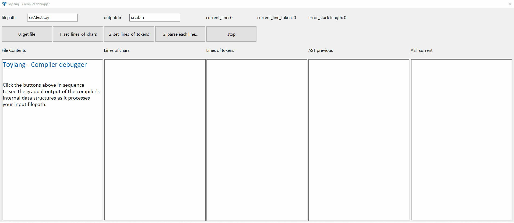

<h1>Toylang</h1>

A functional toy language using Polish Notation / Prefix Notation which compiles to Rust for fun and experimentation (Windows only for now)

Work in progress [VS Code Extension](https://github.com/Swiftaff/toylang-vscode)

Rustdocs [documentation](https://swiftaff.github.io/toylang/toylang/index.html)

Custom [Debugger](#debugger)

## Build

Builds the `/src/main.rs` into an executable at `/target/debug/toylang.exe` or `/target/release/toylang.exe`

```
cargo build
```

or

```
cargo build --release
```

## Usage

Create a file e.g. `test.toy` containing the toy language in the same directory (or elsewhere).

Pass the required input filepath using the input arg (-i or --input)

Pass the optional output directory using the output arg (-o or --output). Otherwise by default `output.rs` is saved into the current directory.
For development you may wish to output to `src\\bin` by convention to make use of `cargo run --bin output` below.

```
toylang -i test.toy
```

or

```
toylang.exe --input ..\\..\\somewhere\\else\\test.toy --output src\\bin
```

Compile errors will appear in the console.

```
TOYLANG COMPILE ERROR:
----------
= monkey monkeys
         ^^^^^^^ is not a valid expression: must be either an: integer, e.g. 12345, float, e.g. 123.45, existing constant, e.g. x, string, e.g. "string", function, e.g. + 1 2
----------
= monkey monkeys
^ No valid expression was found
----------
```

Or on success a compiled `output.rs` file will be saved to the output directory.

You can then build THAT file with cargo as needed, i.e. output to `src\\bin` and add this to the "Cargo.toml"

```
[[bin]]
name = "output"
```

Then compile and run the output file

```
cargo run --bin output
```

or

```
cargo run --release --bin output
```

And your final compiled `output.exe` will be saved to, and run from `\\target\\debug` or `\\target\\release`

## Debugger

Pass the debug flag (-d or --debug) to open an interactive debugger which steps through the state of the Compiler's AST to troublshoot compilation errors.

```
toylang -i test.toy -d
```



## Toy language Syntax Examples

### Hello, world

<table><tr><th>Toy</th><th>Rust</th></tr><tr><td>

```

// print
@ "Hello, world!"
@ 1
@ 1.23

```

</td><td>

```rust
fn main() {
    // print
    println!("{}", "Hello, world!".to_string());
    println!("{}", 1);
    println!("{}", 1.23);
}
```

</td></tr></table>

### Constant assignment

<table><tr><th>Toy</th><th>Rust</th></tr><tr><td>

```

// single line comments
// assign values to constants
= an_integer 123
= a_float 123.45
= a_reference an_integer
= a_string "string"

// basic arithmetic built in functions
= addition + 1 2
= subtraction - 5.4 3.2
= multiplication * 3 4
= division / 1.0 2.0
= modulus % 42.0 3.14

// booleans and equality
= is_true true
= is_false false
// the below constants are all assigned the value true
= equal == 1 1
= not_equal != 1 2
= greater_than > 2 1
= less_than < 1 2
= gte >= 2 1
= lte <= 1 2

// if expressions
= a ? true "true" "false"
= b ? is_true "true" "false"
= c ? < 1 2 "true" "false"

= get_true \ bool => true


= d ? get_true "true" "false"

= get_truer \ i64 bool arg1 => > arg1 5


= e ? get_truer 10 "true" "false"

= get_more_true \ i64 i64 i64 bool arg1 arg2 arg3 =>
  < + arg1 + arg2 arg3 10

= f ? get_more_true 1 2 3 "true" "false"

```

</td><td>

```rust
fn main() {
    // single line comments
    // assign values to constants
    let an_integer: i64 = 123;
    let a_float: f64 = 123.45;
    let a_reference: i64 = an_integer;
    let a_string: String = "string".to_string();

    // basic arithmetic built in functions
    let addition: i64 = 1 + 2;
    let subtraction: f64 = 5.4 - 3.2;
    let multiplication: i64 = 3 * 4;
    let division: f64 = 1.0 / 2.0;
    let modulus: f64 = 42.0 % 3.14;

    // booleans and equality
    let is_true: bool = true;
    let is_false: bool = false;
    // the below constants are all assigned the value true
    let equal: bool = 1 == 1;
    let not_equal: bool = 1 != 2;
    let greater_than: bool = 2 > 1;
    let less_than: bool = 1 < 2;
    let gte: bool = 2 >= 1;
    let lte: bool = 1 <= 2;

    // if expressions
    let a = if true { "true" } else { "false" };
    let b = is_true { "true" } else { "false" };
    let c = 1 < 2 { "true" } else { "false" };

    fn get_true() -> bool {
        true
    }
    let d = get_true() { "true" } else { "false" };

    fn get_truer(arg1: i64) -> bool {
        arg1 > 5
    }
    let e = get_truer(10) { "true" } else { "false" };

    fn get_more_true(arg1: i64, arg2: i64, arg3: i64) -> bool {
        arg1 + arg2 + arg3 < 10
    }
    let f = get_more_true(1, 2, 3) { "true" } else { "false" }
}
```

</td></tr></table>

### Function definition

<table><tr><th>Toy</th><th>Rust</th></tr><tr><td>

```

// single line functions
// one i64 argument, returns i64
= function_name \ i64 i64 arg1 => + 123 arg1
//                ^       ^       ^_return expression
//                 \       \_ argument names
//                  \_argument types, return type last


// multi line functions
// two i64 arguments, returns i64
= multiline_fn_name \ i64 i64 i64 arg1 arg2 =>
= x + arg1 123
= y - x arg2
= z * y 10

// z is the first expression
// (not an assignment) so it is
// the return value of the function
z


// use parenthesis to pass a function
// as an argument - becomes a &dyn Fn
// first argument in parenthesis defines
// a single argument which is a function
// which takes an i64 and returns an i64
// second argument is an i64
// and function returns an i64
= take_fn_as_first_parameter \ (i64 i64) i64 i64 arg1 arg2 =>

// then the function body calls the
// arg1 with arg2 as the parameter
arg1 arg2


// function calls
function_name 123
multiline_fn_name + 123 456 789

// also when passing a function as a parameter
// must wrap it in parenthesis so it doesn't evaluate
take_fn_as_first_parameter ( function_name ) 321


// fibonacci Example
= fibonacci \ i64 i64 n => ? < n 2 1 + fibonacci - n 1 fibonacci - n 2
@ fibonacci 10


```

</td><td>

```rust
fn main() {
    // single line functions
    fn function_name(arg1: i64) -> i64 {
        123 + arg1
    }


    // multi line functions
    // two i64 arguments, returns i64
    fn multiline_fn_name(arg1: i64, arg2: i64) -> i64 {
        let x: i64 = arg1 + 123;
        let y: i64 = x - arg2;
        let z: i64 = y * 10;

        // z is the first expression
        // (not an assignment) so it is
        // the return value of the function
        z
    }

    // use parenthesis to pass a function
    // as an argument - becomes a &dyn Fn
    // first argument in parenthesis defines
    // a single argument which is a function
    // which takes an i64 and returns an i64
    // second argument is an i64
    // and function returns an i64
    fn take_fn_as_first_parameter(arg1: &dyn Fn(i64) -> i64, arg2: i64) -> i64 {

        // then the function body calls the
        // arg1 with arg2 as the parameter
        arg1(arg2)
    }

    // function calls
    function_name(123);
    multiline_fn_name(123 + 456, 789);

    // also when passing a function as a parameter
    // must wrap it in parenthesis so it doesn't evaluate
    take_fn_as_first_parameter(&function_name, 321);


    // fibonacci example
    fn main() {
        fn fibonacci(n: i64) -> i64 {
            if n < 2 {
                1
            } else {
                fibonacci(n - 1) + fibonacci(n - 2)
            }
        }
        println!("{}", fibonacci(10));
    }

}
```

</td></tr></table>

### Lists

<table><tr><th>Toy</th><th>Rust</th></tr><tr><td>

```

// empty Lists
= empty1 [ i64 ]
= empty2 [ f64 ]

// list of Ints
= ints [ 1 2 3 4 5 ]

// list of floats
= floats [ 1.1 2.2 3.3 ]

// list of strings
= strings [ "1" "2" "3" ]

// map
= list [ 1 ]
= mapfn \ i64 i64 i => * i 100


= mapped List::map list ( mapfn )

// append
= list1 [ 1 ]
= list2 [ 2 3 ]
= appended List::append list1 list2

// len
= list [ 1 2 3 ]
= len List::len list

```

</td><td>

```rust
fn main() {
    // empty lists
    let empty1: Vec<i64> = vec![];
    let empty2: Vec<f64> = vec![];

    // list of Ints
    let ints = vec![ 1, 2, 3 ];

    // list of floats
    let floats = vec![ 1.1, 2.2, 3.3];

    // list of strings
    let strings = vec![ "1".to_string(), "2".to_string(), "3".to_string() ];

    // map
    let list: Vec<i64> = vec![ 1 ];
    fn mapfn(i: i64) -> i64 {
        i * 100
    }
    let mapped: Vec<i64> = list.iter().map(mapfn).collect();

    // append
    let list1: Vec<i64> = vec![ 1 ];
    let list2: Vec<i64> = vec![ 2 3 ];
    let appended: Vec<i64> = list1.iter().cloned().chain(list2.iter().cloned()).collect();

    // len
    let list: Vec<i64> = [1, 2, 3];
    let len: i64 = list.len() as i64;
}
```

</td></tr></table>

### Structs

<table><tr><th>Toy</th><th>Rust</th></tr><tr><td>

```
// Define a struct
= newstruct { = firstname "firstname" = surname "surname" = age 21 }

// Or, using short notation using ConstantRefs
// = firstname "firstname"
// = surname "surname"
// = age 21
// = newstruct { firstname surname age }


//Edit a struct
= newstruct.age 99

//Print (debug) a full struct
@ newstruct
//
```

</td><td>

```rust
// Define a struct
#[derive(Clone, Debug)]
pub struct Newstruct {
    pub firstname: String,
    pub surname: String,
    pub age: i64,
}

impl Newstruct {
    pub fn new(firstname: String, surname: String, age: i64) -> Newstruct {
        Newstruct {
            firstname,
            surname,
            age,
        }
    }
}

fn main() {
    let mut newstruct: Newstruct = Newstruct::new("firstname".to_string(), "surname".to_string(), 21);

    //Edit a struct
    newstruct.age = 99;

    //Print (debug) a full struct
    println!("{:?}", &newstruct);
}
```

</td></tr></table>
